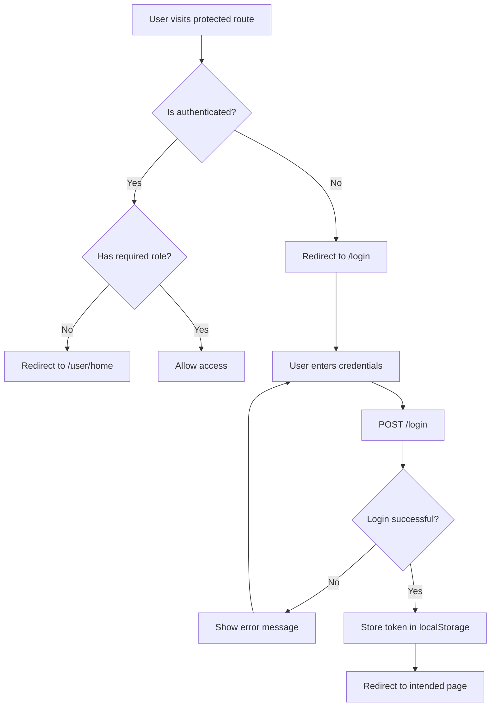
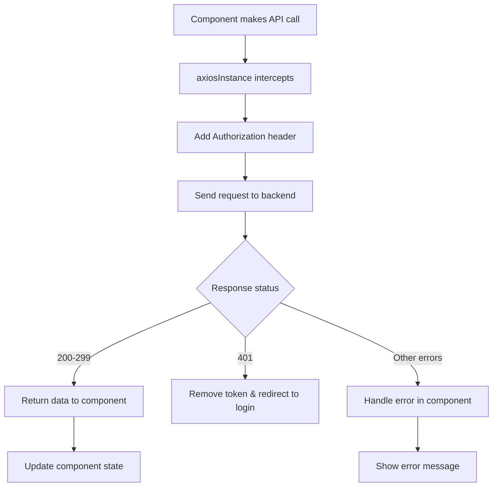
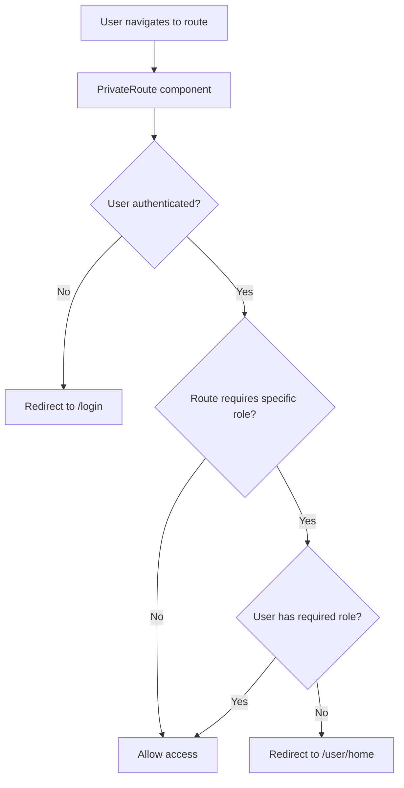

# API & Routing Flow Documentation

## 📋 Tổng quan

Tài liệu này mô tả flow giao tiếp API và hệ thống routing trong ứng dụng PetVibe.

## 🗂️ Cấu trúc Routing

### 1. **Centralized Routes** (`src/routes/index.js`)

```javascript
// Cấu trúc routes được tổ chức theo nhóm
export const routeConfig = {
  public: [...],      // Routes công khai
  user: [...],        // Routes cho user đã đăng nhập
  admin: [...],       // Routes cho admin
  shop: [...],        // Routes cho shop owner
  legacy: [...]       // Routes cũ (để backward compatibility)
};
```

### 2. **Route Categories**

#### **Public Routes** (Không cần authentication)
- `/` - Home page
- `/about` - About page
- `/contact` - Contact page
- `/services` - Services page
- `/shop` - Public shop
- `/login` - Login page
- `/register` - Register page

#### **User Routes** (Cần authentication)
- `/user/home` - User home
- `/user/profile` - User profile
- `/user/shop` - User shop
- `/user/orders` - User orders
- `/user/ai-analysis` - AI Analysis
- `/user/pets` - My Pets
- `/user/premium` - Premium features
- `/user/chat` - Chat feature

#### **Admin Routes** (Cần admin role)
- `/admin` - Admin dashboard
- `/admin/reports` - Reports
- `/admin/users` - User management

#### **Shop Routes** (Cần shop_owner role)
- `/shop/analytics` - Shop analytics
- `/shop/orders` - Shop orders
- `/shop/products` - Shop products

## 🔄 API Flow

### 1. **Authentication Flow**



### 2. **API Request Flow**



### 3. **Route Protection Flow**



## 🛠️ Implementation Details

### 1. **API Configuration** (`src/config/api.js`)

```javascript
const API_CONFIG = {
  BASE_URL: 'https://exe201-be-uhno.onrender.com/api',
  ENDPOINTS: {
    LOGIN: '/login',
    REGISTER: '/register',
    ACCOUNT: '/account',
    VERIFY_TOKEN: '/auth/verify'
  }
};
```

### 2. **Axios Instance** (`src/api/axiosInstance.js`)

```javascript
// Tự động thêm Authorization header
axiosInstance.interceptors.request.use((config) => {
  const token = localStorage.getItem('authToken');
  if (token) {
    config.headers.Authorization = `Bearer ${token}`;
  }
  return config;
});

// Xử lý 401 errors
axiosInstance.interceptors.response.use(
  (response) => response,
  (error) => {
    if (error.response?.status === 401) {
      localStorage.removeItem('authToken');
      window.location.href = '/login';
    }
    return Promise.reject(error);
  }
);
```

### 3. **Private Route Component** (`src/components/auth/PrivateRoute.jsx`)

```javascript
const PrivateRoute = ({ children, roles = [] }) => {
  const { user, isAuthenticated } = useAuth();
  
  if (!isAuthenticated) {
    return <Navigate to="/login" replace />;
  }
  
  if (roles.length > 0 && !roles.includes(user.role)) {
    return <Navigate to="/user/home" replace />;
  }
  
  return children;
};
```

## 📱 Component Communication

### 1. **Navigation Flow**

```javascript
// Trong component
import { useNavigate } from 'react-router-dom';

const navigate = useNavigate();

// Navigate to user profile
navigate('/user/profile');

// Navigate with state
navigate('/user/orders', { state: { orderId: 123 } });
```

### 2. **API Calls in Components**

```javascript
// Login component
const handleLogin = async (credentials) => {
  try {
    const response = await authApi.login(credentials.phone, credentials.password);
    localStorage.setItem('authToken', response.token);
    navigate('/user/home');
  } catch (error) {
    setError(error.response.data.message);
  }
};
```

### 3. **Context Usage**

```javascript
// AuthContext provides global state
const { user, isAuthenticated, login, logout } = useAuth();

// Use in any component
if (isAuthenticated) {
  return <UserDashboard user={user} />;
}
```

## 🔐 Security Features

### 1. **Token Management**
- JWT tokens stored in localStorage
- Automatic token refresh (if implemented)
- Token validation on each request

### 2. **Route Protection**
- PrivateRoute component protects authenticated routes
- Role-based access control
- Automatic redirects for unauthorized access

### 3. **API Security**
- CORS configuration on backend
- Request/Response interceptors
- Error handling and logging

## 🚀 Best Practices

### 1. **API Calls**
```javascript
// ✅ Good: Use centralized API functions
const response = await authApi.login(phone, password);

// ❌ Bad: Direct axios calls
const response = await axios.post('/login', data);
```

### 2. **Navigation**
```javascript
// ✅ Good: Use navigate hook
const navigate = useNavigate();
navigate('/user/profile');

// ❌ Bad: Direct window.location
window.location.href = '/user/profile';
```

### 3. **Error Handling**
```javascript
// ✅ Good: Comprehensive error handling
try {
  const response = await api.call();
  setData(response.data);
} catch (error) {
  if (error.response?.status === 401) {
    logout();
  } else {
    setError(error.response?.data?.message || 'Something went wrong');
  }
}
```

## 📊 Monitoring & Debugging

### 1. **API Logging**
- Request/Response logging in development
- Error tracking and reporting
- Performance monitoring

### 2. **Route Debugging**
- Route protection testing
- Navigation flow verification
- Role-based access testing

### 3. **Development Tools**
- React DevTools for state inspection
- Network tab for API monitoring
- Console logging for debugging

## 🔄 Migration Guide

### From Old Routing to New System:

1. **Update App.js**:
```javascript
// Old
<Routes>
  <Route path="/user/home" element={<UserHome />} />
</Routes>

// New
import { AppRoutes } from './routes';
<AppRoutes />
```

2. **Use Route Helpers**:
```javascript
import { getRoutesByRole } from './routes';

const userRoutes = getRoutesByRole('user');
```

3. **Update Navigation**:
```javascript
// Use centralized route paths
navigate('/user/profile'); // Instead of hardcoded paths
```

## 📝 File Structure

```
src/
├── routes/
│   └── index.js              # Centralized routing
├── config/
│   └── api.js                # API configuration
├── api/
│   ├── axiosInstance.js      # Axios setup
│   ├── authApi.js           # Auth API calls
│   └── publicApi.js         # Public API calls
├── components/
│   └── auth/
│       └── PrivateRoute.jsx  # Route protection
└── context/
    └── AuthContext.jsx       # Global auth state
```

Hệ thống này đảm bảo:
- **Centralized routing** - Dễ quản lý và maintain
- **Type safety** - Consistent route paths
- **Security** - Proper authentication và authorization
- **Scalability** - Dễ dàng thêm routes mới
- **Debugging** - Clear flow và error handling
